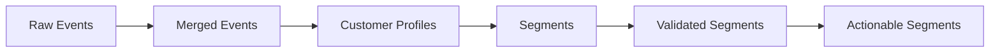

# Data Flow

How data transforms through the segmentation pipeline.

## Overview



## Stage-by-Stage

### 1. Data Acquisition

**Input:** Configuration
**Output:** Events, ID History

```python
# Internal flow
config = PipelineConfig(n_customers=500)

dataset = generate_small_dataset(
    n_customers=config.n_customers,
    seed=config.data_seed,
)

events: list[EventRecord] = dataset.events
id_history: list[CustomerIdHistory] = dataset.id_history
```

**Data Shape:**

| Field | Type | Example |
|-------|------|---------|
| `events` | `list[EventRecord]` | 5000 events |
| `id_history` | `list[CustomerIdHistory]` | 75 merge records |

---

### 2. ID Resolution

**Input:** Customer ID History
**Output:** Merge Map

```python
merge_map = resolve_customer_merges(id_history)
# {"old_id_1": "canonical_id", "old_id_2": "canonical_id", ...}
```

Handles:
- Direct merges: A → B
- Chain merges: A → B → C (resolves to A → C, B → C)
- Circular detection: A → B → A (raises error)

---

### 3. Profile Building

**Input:** Events, Merge Map
**Output:** Customer Profiles

```python
builder = ProfileBuilder()
profiles = builder.build_profiles(events, merge_map)
```

**Profile Structure:**

```python
CustomerProfile(
    customer_id="cust_001",
    total_revenue=Decimal("1250.00"),
    purchase_count=8,
    avg_order_value=Decimal("156.25"),
    purchase_frequency=0.5,
    days_since_last_purchase=15,
    session_count=45,
    avg_pages_per_session=4.2,
    preferred_day="Saturday",
    preferred_hour=14,
    top_categories=["Electronics", "Books"],
    clv_estimate=Decimal("3750.00"),
    churn_risk=0.15,
)
```

---

### 4. Clustering

**Input:** Customer Profiles
**Output:** Segments, Clustering Metadata

```python
clusterer = CustomerClusterer(n_clusters=5)
result = clusterer.cluster(profiles)

segments: list[Segment] = result.segments
silhouette: float = result.silhouette
inertia: float = result.inertia
```

**Segment Structure:**

```python
Segment(
    segment_id="segment_0",
    name="High-Value Loyalists",
    size=85,
    customer_ids=["cust_001", "cust_042", ...],
    total_clv=Decimal("42500.00"),
    avg_clv=Decimal("500.00"),
    avg_order_value=Decimal("175.00"),
    defining_traits=["high_revenue", "frequent_purchases", "low_churn"],
    cluster_center=[0.82, -0.15, 1.23, ...],
)
```

---

### 5. Sensitivity Analysis

**Input:** Profiles, Segments
**Output:** Sensitivity Results

```python
analyzer = SensitivityAnalyzer()
sensitivity = analyzer.analyze_segments(profiles, segments)
```

**Tests Performed:**

| Test | Description | Output |
|------|-------------|--------|
| Feature Drop | Remove each feature, re-cluster | `feature_stability: float` |
| Time Window | Cluster different periods | `time_consistency: float` |
| Bootstrap | Re-sample and cluster | `sampling_stability: float` |

---

### 6. Robustness Scoring

**Input:** Sensitivity Results
**Output:** Per-Segment Scores

```python
robustness_scores: dict[str, RobustnessScore] = sensitivity.segment_robustness
```

**Score Structure:**

```python
RobustnessScore(
    segment_id="segment_0",
    feature_stability=0.75,
    time_consistency=0.82,
    sampling_stability=0.68,
    overall_robustness=0.75,
    robustness_tier=RobustnessTier.MEDIUM,
)
```

---

### 7. Validation

**Input:** Segments, Robustness Scores
**Output:** Validation Results

```python
validator = SegmentValidator(criteria)
validations = {
    seg.segment_id: validator.validate(seg, robustness_scores[seg.segment_id])
    for seg in segments
}
```

**Validation Checks:**

- Minimum segment size
- Maximum segment size percentage
- Minimum total CLV
- Minimum robustness score
- Minimum feature stability

---

### 8. Viability Assessment

**Input:** Segments
**Output:** Viability Scores

```python
viabilities = {
    seg.segment_id: validator.assess_viability(seg)
    for seg in segments
}
```

**Viability Structure:**

```python
SegmentViability(
    segment_id="segment_0",
    is_viable=True,
    expected_roi=1.85,
    campaign_cost_estimate=Decimal("5000.00"),
    expected_revenue_lift=Decimal("9250.00"),
    strategic_impact="high",
    reasoning="Large high-value segment with low churn risk",
)
```

---

### 9. Actionability Evaluation

**Input:** Segments
**Output:** Actionability Evaluations

```python
filter = ActionabilityFilter()
evaluations = {
    seg.segment_id: filter.evaluate(seg)
    for seg in segments
}
```

**Evaluation Structure:**

```python
ActionabilityEvaluation(
    segment_id="segment_0",
    is_actionable=True,
    what_dimension="Electronics, Premium products",
    when_dimension="Weekends, Afternoon",
    how_dimension="Email, Push notifications",
    who_dimension="High-value tier",
    recommended_action="Premium electronics campaign on weekends",
    confidence_level=ConfidenceLevel.HIGH,
)
```

---

### 10. Explanation Generation

**Input:** Segments, Evaluations
**Output:** Business Explanations

```python
explainer = SegmentExplainer()
explanations = {
    seg.segment_id: explainer.explain(seg, evaluations[seg.segment_id])
    for seg in segments
}
```

**Explanation Structure:**

```python
SegmentExplanation(
    segment_id="segment_0",
    executive_summary="High-value customers who prefer premium electronics",
    recommended_campaign="Weekend Flash Sale - Premium Electronics",
    key_insights=["Strong affinity for premium brands", "Weekend shoppers"],
    expected_roi="150-200% based on historical performance",
    confidence_level=ConfidenceLevel.HIGH,
    confidence_reasoning="Stable segment with clear behavioral patterns",
)
```

---

### 11. Report Generation

**Input:** All Pipeline Outputs
**Output:** Comprehensive Report

```python
report = generate_segmentation_report(
    segments=segments,
    robustness_scores=robustness_scores,
    viabilities=viabilities,
    actionability_evaluations=evaluations,
    explanations=explanations,
)
```

## Data Transformations Summary

| Stage | Input Type | Output Type | Transformation |
|-------|-----------|-------------|----------------|
| Data Acquisition | Config | Events, IDs | Generation |
| ID Resolution | ID History | Merge Map | Deduplication |
| Profile Building | Events | Profiles | Aggregation |
| Clustering | Profiles | Segments | ML Grouping |
| Sensitivity | Profiles, Segments | Scores | Stability Testing |
| Validation | Segments, Scores | Results | Rule Application |
| LLM Evaluation | Segments | Evaluations | AI Analysis |
| Reporting | All | Report | Consolidation |
