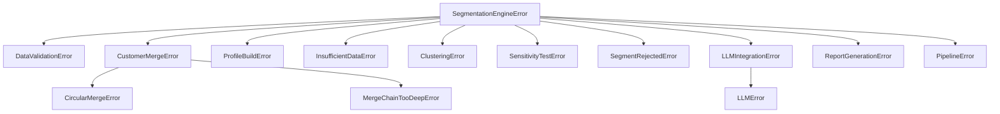

# Exception Handling

Error types and handling strategies in the Actionable Segmentation Engine.

## Exception Hierarchy



## Base Exception

All exceptions inherit from `SegmentationEngineError`:

```python
class SegmentationEngineError(Exception):
    """Base exception for all segmentation engine errors."""

    def __init__(self, message: str, *, context: dict[str, Any] | None = None):
        self.message = message
        self.context = context or {}
        super().__init__(message)
```

**Features:**
- Structured context for debugging
- Consistent interface across all errors
- Easy to catch all engine errors

## Exception Categories

### Data Errors

#### DataValidationError

Raised when input data fails validation.

```python
raise DataValidationError(
    "Invalid event record",
    context={"field": "event_type", "value": None}
)
```

**Common Causes:**
- Missing required fields
- Invalid field types
- Out-of-range values

#### CustomerMergeError

Base for ID merge issues.

##### CircularMergeError

```python
raise CircularMergeError(
    "Circular merge detected",
    context={"chain": ["id_1", "id_2", "id_1"]}
)
```

##### MergeChainTooDeepError

```python
raise MergeChainTooDeepError(
    "Merge chain exceeds maximum depth",
    context={"depth": 100, "max_depth": 50}
)
```

### Processing Errors

#### ProfileBuildError

Raised during profile aggregation.

```python
raise ProfileBuildError(
    "Failed to build profile",
    context={"customer_id": "cust_123", "reason": "no events"}
)
```

#### InsufficientDataError

Not enough data for operation.

```python
raise InsufficientDataError(
    "Need at least 30 customers for clustering",
    context={"actual": 15, "required": 30}
)
```

### Clustering Errors

#### ClusteringError

KMeans or clustering failures.

```python
raise ClusteringError(
    "KMeans failed to converge",
    context={"n_clusters": 5, "max_iter": 300}
)
```

**Common Causes:**
- Zero-variance features
- Too few data points
- Numerical instability

#### SensitivityTestError

Sensitivity analysis failures.

```python
raise SensitivityTestError(
    "Feature drop test failed",
    context={"feature": "revenue", "error": "empty result"}
)
```

### Validation Errors

#### SegmentRejectedError

Segment fails validation criteria.

```python
raise SegmentRejectedError(
    "Segment rejected",
    context={
        "segment_id": "seg_001",
        "reasons": ["size too small", "low robustness"]
    }
)
```

### LLM Errors

#### LLMIntegrationError

Wrapper for LLM layer issues.

```python
raise LLMIntegrationError(
    "Failed to evaluate segment",
    context={"segment_id": "seg_001"}
)
```

#### LLMError

Direct LLM API failures.

```python
raise LLMError(
    "Claude API rate limited",
    context={"status_code": 429, "retry_after": 60}
)
```

### Output Errors

#### ReportGenerationError

Report creation failures.

```python
raise ReportGenerationError(
    "Failed to generate report",
    context={"stage": "visualization"}
)
```

#### PipelineError

Pipeline orchestration failures.

```python
raise PipelineError(
    "Pipeline failed at clustering stage",
    stage="clustering",
    context={"duration_ms": 150}
)
```

## Error Handling Patterns

### Catch Specific Errors

```python
from src.exceptions import InsufficientDataError, ClusteringError

try:
    result = run_pipeline(config)
except InsufficientDataError as e:
    print(f"Need more data: {e.context}")
except ClusteringError as e:
    print(f"Clustering failed: {e.context}")
```

### Catch All Engine Errors

```python
from src.exceptions import SegmentationEngineError

try:
    result = run_pipeline(config)
except SegmentationEngineError as e:
    print(f"Engine error: {e.message}")
    print(f"Context: {e.context}")
```

### Access Context

```python
try:
    result = run_pipeline(config)
except SegmentationEngineError as e:
    # Log structured context
    logger.error(
        "Pipeline failed",
        extra={
            "error_type": type(e).__name__,
            "message": e.message,
            **e.context,
        }
    )
```

### Pipeline Stage Errors

```python
try:
    result = run_pipeline(config)
except PipelineError as e:
    print(f"Failed at stage: {e.stage}")
    # Check stage results for partial output
```

## Best Practices

!!! tip "Use Specific Exceptions"
    Catch the most specific exception type for better error handling.

!!! tip "Check Context"
    Exception context contains debugging information - always log it.

!!! tip "Graceful Degradation"
    Consider fallback strategies for recoverable errors.

```python
try:
    result = run_pipeline(config)
except LLMIntegrationError:
    # Fall back to mock LLM
    config.use_llm = False
    result = run_pipeline(config)
```

## Error Recovery

### Insufficient Data

```python
try:
    result = run_pipeline(config)
except InsufficientDataError:
    # Try with fewer clusters
    config.n_clusters = 3
    result = run_pipeline(config)
```

### LLM Failures

```python
try:
    result = run_pipeline(PipelineConfig(use_llm=True))
except LLMIntegrationError:
    # Fall back to mock
    result = run_pipeline(PipelineConfig(use_llm=False))
```

### Validation Failures

```python
# Instead of failing, access raw segments
result = run_pipeline(config)

if not result.valid_segments:
    # Still have access to all segments
    print("No valid segments, but raw segments available:")
    for seg in result.segments:
        print(f"  {seg.name}: {seg.size} customers")
```
