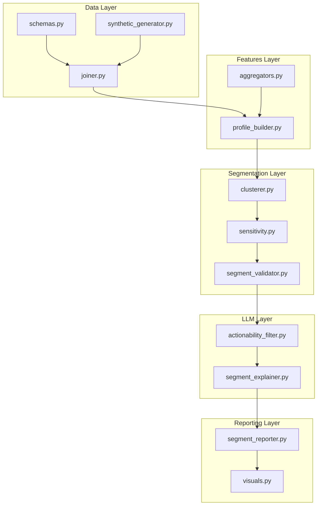

# Architecture

Technical documentation of the Actionable Segmentation Engine architecture.

## Overview

The engine uses a **modular pipeline architecture** that transforms raw event data into actionable customer segments with business insights.

## Sections

-   :material-sitemap:{ .lg .middle } **System Overview**

    ---

    High-level architecture and design principles

    [:octicons-arrow-right-24: Overview](overview.md)

-   :material-transit-connection-variant:{ .lg .middle } **Data Flow**

    ---

    How data moves through the pipeline

    [:octicons-arrow-right-24: Data Flow](data-flow.md)

-   :material-package-variant:{ .lg .middle } **Module Reference**

    ---

    Detailed module documentation

    [:octicons-arrow-right-24: Modules](modules.md)

-   :material-alert:{ .lg .middle } **Exception Handling**

    ---

    Error types and handling strategies

    [:octicons-arrow-right-24: Exceptions](exceptions.md)

## Key Design Decisions

See the [ADRs](../adrs/index.md) for detailed rationale:

| Decision | Rationale |
|----------|-----------|
| Pydantic v2 | Type-safe data validation at boundaries |
| KMeans | Interpretable, fast, well-understood clustering |
| Mock LLM | Enable testing without API costs |
| Robustness-first | Only stable segments reach production |
| Functional core | Easy testing with pure functions |
