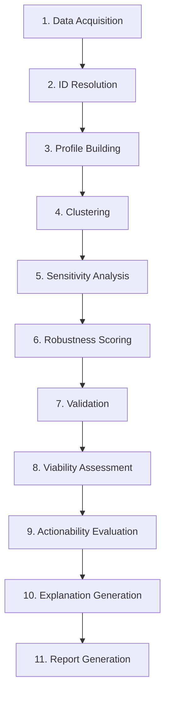

# Pipeline Overview

The segmentation pipeline transforms raw event data into actionable customer segments through 11 stages.

## Pipeline Stages



## Stage Details

### 1. Data Acquisition

**Input:** Configuration
**Output:** Raw events, customer ID history

Generates or loads customer event data:

```python
from src.data.synthetic_generator import generate_small_dataset

dataset = generate_small_dataset(n_customers=500, seed=42)
print(f"Events: {dataset.n_events}")
print(f"Customers: {dataset.n_customers}")
```

### 2. ID Resolution

**Input:** Customer ID history
**Output:** Merge map (old_id → canonical_id)

Resolves customer identity across devices:

```python
from src.data.joiner import resolve_customer_merges

merge_map = resolve_customer_merges(id_history)
# {"old_id_1": "canonical_id", "old_id_2": "canonical_id"}
```

### 3. Profile Building

**Input:** Events, merge map
**Output:** Customer profiles

Aggregates events into customer profiles:

```python
from src.features.profile_builder import ProfileBuilder

builder = ProfileBuilder()
profiles = builder.build_profiles(events, merge_map)
```

Profile contains:
- Revenue metrics (total, average, frequency)
- Engagement metrics (sessions, page views)
- Temporal patterns (preferred days/hours)
- CLV estimate

### 4. Clustering

**Input:** Customer profiles
**Output:** Segments with cluster assignments

KMeans clustering with optional auto k-selection:

```python
from src.segmentation.clusterer import CustomerClusterer

clusterer = CustomerClusterer(n_clusters=5)
result = clusterer.cluster(profiles)
segments = result.segments
```

### 5. Sensitivity Analysis

**Input:** Profiles, segments
**Output:** Sensitivity results

Tests segment stability:

```python
from src.segmentation.sensitivity import SensitivityAnalyzer

analyzer = SensitivityAnalyzer()
sensitivity = analyzer.analyze_segments(profiles, segments)
```

Tests performed:
- **Feature drop** - Remove each feature, re-cluster
- **Time window** - Cluster different time periods
- **Bootstrap sampling** - Re-sample and cluster

### 6. Robustness Scoring

**Input:** Sensitivity results
**Output:** Per-segment robustness scores

```python
robustness_scores = sensitivity.segment_robustness
# {segment_id: RobustnessScore}
```

### 7. Validation

**Input:** Segments, robustness scores
**Output:** Validation results

Applies business criteria:

```python
from src.segmentation.segment_validator import SegmentValidator

validator = SegmentValidator(criteria)
validations = {
    seg.segment_id: validator.validate(seg, robustness)
    for seg in segments
}
```

### 8. Viability Assessment

**Input:** Segments, validations
**Output:** Economic viability scores

Assesses ROI potential:

```python
viabilities = {
    seg.segment_id: validator.assess_viability(seg)
    for seg in segments
}
```

### 9. Actionability Evaluation

**Input:** Segments
**Output:** Actionability evaluations

LLM evaluates segment actionability:

```python
from src.llm.actionability_filter import ActionabilityFilter

filter = ActionabilityFilter()
evaluations = {
    seg.segment_id: filter.evaluate(seg)
    for seg in segments
}
```

Evaluates dimensions:
- **WHAT** - Product preferences
- **WHEN** - Timing patterns
- **HOW** - Channel preferences
- **WHO** - Customer value tier

### 10. Explanation Generation

**Input:** Segments, evaluations
**Output:** Business explanations

LLM generates human-readable insights:

```python
from src.llm.segment_explainer import SegmentExplainer

explainer = SegmentExplainer()
explanations = {
    seg.segment_id: explainer.explain(seg, evaluation)
    for seg in segments
}
```

### 11. Report Generation

**Input:** All pipeline outputs
**Output:** Comprehensive report

```python
from src.reporting.segment_reporter import generate_segmentation_report

report = generate_segmentation_report(
    segments=segments,
    robustness_scores=robustness_scores,
    viabilities=viabilities,
    actionability_evaluations=evaluations,
    explanations=explanations,
)
```

## Pipeline Result

The `PipelineResult` provides access to all outputs:

```python
result = run_pipeline(config)

# Direct access
result.profiles          # List[CustomerProfile]
result.segments          # List[Segment]
result.robustness_scores # Dict[str, RobustnessScore]
result.viabilities       # Dict[str, SegmentViability]
result.evaluations       # Dict[str, ActionabilityEvaluation]
result.explanations      # Dict[str, SegmentExplanation]
result.report            # SegmentationReport

# Convenience properties
result.valid_segments           # Segments passing validation
result.actionable_segments      # Segments with actionable dimensions
result.production_ready_segments # Valid AND actionable
```

## Stage Timing

Access per-stage timing:

```python
for stage in result.stage_results:
    status = "OK" if stage.success else "FAILED"
    print(f"{stage.stage_name}: {stage.duration_ms:.1f}ms [{status}]")
```
