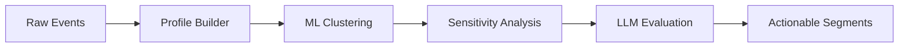

# Actionable Segmentation Engine

<div class="grid cards" markdown>

-   :material-rocket-launch:{ .lg .middle } **Get Started in 5 Minutes**

    ---

    Install the package and run your first segmentation pipeline

    [:octicons-arrow-right-24: Quick Start](getting-started/quickstart.md)

-   :material-book-open-variant:{ .lg .middle } **User Guide**

    ---

    Learn how to configure pipelines, work with segments, and export results

    [:octicons-arrow-right-24: User Guide](guide/index.md)

-   :material-cog:{ .lg .middle } **Architecture**

    ---

    Understand the system design, data flow, and module structure

    [:octicons-arrow-right-24: Architecture](architecture/index.md)

-   :material-api:{ .lg .middle } **API Reference**

    ---

    Complete API documentation auto-generated from source code

    [:octicons-arrow-right-24: API Reference](reference/index.md)

</div>

## Overview

The **Actionable Segmentation Engine** transforms raw customer event data into commercially exploitable customer insights using a hybrid ML + LLM architecture.



## Key Features

| Feature | Description |
|---------|-------------|
| **Synthetic Data Generation** | Test pipelines without real customer data |
| **Customer ID Merge Resolution** | Handle cross-device customer unification |
| **ML Clustering** | KMeans with automatic k-selection |
| **Robustness Validation** | Feature and time window sensitivity tests |
| **LLM Actionability** | AI-powered segment evaluation |
| **Business Insights** | Human-readable explanations and recommendations |

## Quick Example

```python
from src.pipeline import quick_segmentation

# Run segmentation with synthetic data
result = quick_segmentation(n_customers=500, n_clusters=5, seed=42)

# Get production-ready segments
for segment in result.production_ready_segments:
    print(f"{segment.name}: {segment.size} customers, ${segment.total_clv:,.0f} CLV")
```

## Pipeline Output

The pipeline produces rich outputs at each stage:

- **Customer Profiles** - Aggregated metrics per customer
- **Segments** - ML-generated customer clusters
- **Robustness Scores** - Stability metrics per segment
- **Viability Assessments** - Economic evaluation
- **Actionability Evaluations** - LLM assessment results
- **Business Explanations** - Human-readable insights

## Project Status

!!! success "Production Ready"
    - **492 tests** passing
    - **94% code coverage**
    - **Full type safety** with mypy strict mode

## License

This project is licensed under the MIT License.
